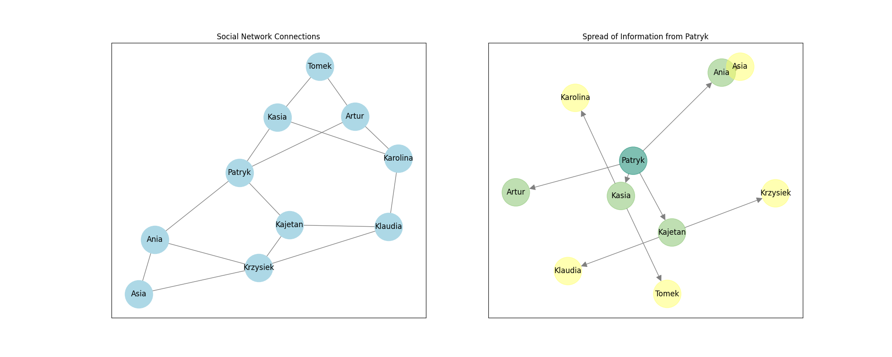

# TGiS-BFS Documentation

Welcome to the TGiS-BFS project documentation.

## Overview

Application of the BFS algorithm to analyze the spread of information in social networks

Python-based application designed to analyze the spread of information within social networks using the Breadth-First Search (BFS) algorithm. This tool allows users to visualize social network connections and the spread of information from a given starting node.



## Features

- **Graph Creation**: Create social network graphs from a list of nodes and edges.
- **Random Community Generation**: Generate random community graphs with specified parameters.
- **BFS Algorithm**: Perform BFS traversal to analyze the spread of information.
- **Visualization**: Visualize social network connections and the spread of information using Matplotlib.
- **Debug Mode**: Enable debug mode to print detailed information during the BFS traversal.

## Installation

To install the required dependencies, it is recommended to use a virtual environment. Follow the steps below:

Clone the repository:

```sh
git clone https://github.com/patrykgacek/TGiS-BFS. git
cd TGiS-BFS
```

Create and activate a virtual environment:

```sh
python -m venv venv
source venv/bin/activate  # On Windows use `venv\Scripts\activate`
```

Install the dependencies:

```sh
pip install -r requirements.txt
```

## Usage

### Running the Main Script

To run the main script and visualize the social network and information spread, use the following command:

```sh
python src/main.py
```

### Running Tests

To run the unit tests, use the following command:

```sh
python -m unittest discover -s tests
```

### Example Code

Here is an example of how to use the BfsCommunityGraph class:

```python
from models.bfs_community_graph import BfsCommunityGraph

people = [
    "Patryk",
    "Kasia",
    "Kajetan",
    "Ania",
    "Artur",
    "Karolina",
    "Tomek",
    "Klaudia",
    "Krzysiek",
    "Asia",
]

connections = [
    ("Patryk", "Kasia"),
    ("Patryk", "Kajetan"),
    ("Patryk", "Ania"),
    ("Patryk", "Artur"),
    ("Kasia", "Karolina"),
    ("Kasia", "Tomek"),
    ("Kajetan", "Klaudia"),
    ("Kajetan", "Krzysiek"),
    ("Ania", "Asia"),
    ("Ania", "Krzysiek"),
    ("Artur", "Karolina"),
    ("Artur", "Tomek"),
    ("Karolina", "Klaudia"),
    ("Klaudia", "Krzysiek"),
    ("Krzysiek", "Asia"),
]

graph = BfsCommunityGraph(debug=True)
graph.make_graph(people, connections) # creates a graph from a list of people and their connections
order = graph.run() # runs the BFS algorithm
graph.draw_compare() # draws a comparison of the original connections and the spread of information.
graph.draw_compare() # draws the graph of all social connections provided by the user.
graph.draw_spread() # draws the graph of the resulted information spread.
```

Instead of using `make_graph`, you can use `random_community` to generate a sample network, where you can adjust the number of people and the probabilities of connections between them:

```python
graph.random_community(5, 0.4)
```

This will create a network with 5 individuals, where the probability of a connection between any two individuals is 40% (0.4).
